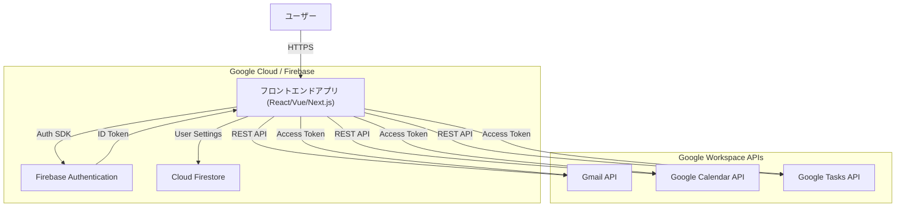

# 基本設計書：Google Workspace 統合ダッシュボード

## 1\. 概要

本システムは、Google Workspaceの主要サービス（Gmail、Google Calendar、Google Tasks）を単一の画面（Single Pane of Glass）で閲覧・操作可能なWebアプリケーションである。
バックエンドでのデータ同期は行わず、フロントエンドから直接各Google APIを参照・操作することで、リアルタイムかつ軽量な動作を実現する。

## 2\. システム構成図 (アーキテクチャ)

## 3\. 技術スタック

| カテゴリ | 技術要素 | 備考 |
| :--- | :--- | :--- |
| **Frontend** | Next.js (TypeScript) | SPA (Single Page Application) として構築 |
| **Language** | TypeScript | 型安全性確保のため推奨 |
| **Auth** | Firebase Authentication | Google Sign-In プロバイダを使用 |
| **Database** | Cloud Firestore | アプリ設定（更新頻度、表示設定など）の保存のみに使用 |
| **Hosting** | Firebase Hosting / Vercel | フロントエンドのデプロイ先 |
| **Libraries** | Google API Client Library for JS (gapi) | Google APIへのアクセスに使用 |

## 4\. データベース設計 (Cloud Firestore)

Google Workspaceのデータ自体は保存せず、アプリの「設定値」のみを管理する。

### Collection: `users`

ドキュメントID: `{uid}` (Firebase AuthのUser ID)

| フィールド名 | 型 | 説明 | 例 |
| :--- | :--- | :--- | :--- |
| `settings.refreshInterval` | Number | 新着確認の間隔 (ミリ秒) | `300000` (5分) |
| `settings.defaultView` | String | 初期表示タブ | `"dashboard"` |
| `settings.theme` | String | テーマ設定 | `"dark"` |
| `createdAt` | Timestamp | 作成日時 | |
| `updatedAt` | Timestamp | 更新日時 | |

**セキュリティルール:**
ユーザーは自分自身のドキュメント (`request.auth.uid == request.resource.id`) のみが読み書き可能。

## 5\. 外部連携 (Google APIs)

### 5.1 必要なAPIスコープ (OAuth Scopes)

ユーザーの承認画面で以下の権限を要求する。

  * `https://www.googleapis.com/auth/gmail.modify` (メールの読み書き・送信・削除)
  * `https://www.googleapis.com/auth/calendar` (カレンダーの読み書き)
  * `https://www.googleapis.com/auth/tasks` (タスクの読み書き)

### 5.2 実装機能と使用エンドポイント

#### A. Gmail連携

  * **一覧取得:** `GET /gmail/v1/users/me/messages` (`q=is:inbox` 等でフィルタ)
  * **詳細取得:** `GET /gmail/v1/users/me/messages/{id}`
  * **メール送信:** `POST /gmail/v1/users/me/messages/send`
  * **既読/削除:** `POST /gmail/v1/users/me/messages/{id}/modify`

#### B. Google Calendar連携

  * **予定一覧:** `GET /calendar/v3/calendars/primary/events` (`timeMin`, `timeMax` 指定)
  * **予定作成:** `POST /calendar/v3/calendars/primary/events`
  * **予定削除:** `DELETE /calendar/v3/calendars/primary/events/{eventId}`

#### C. Google Tasks連携

  * **リスト取得:** `GET /tasks/v1/users/@me/lists`
  * **タスク一覧:** `GET /tasks/v1/lists/{tasklist}/tasks`
  * **タスク作成:** `POST /tasks/v1/lists/{tasklist}/tasks`
  * **完了更新:** `PATCH /tasks/v1/lists/{tasklist}/tasks/{task}` (`status='completed'`)

## 6\. アプリケーションロジック

### 6.1 初期化フロー (Startup)

1.  **ログイン:** Firebase Authでログイン状態を確認。
2.  **設定取得:** Firestoreからユーザー設定（`refreshInterval` 等）を取得。
      * ※初回ログイン時はデフォルト値でドキュメントを作成。
3.  **データ取得:** `Promise.all` を使用して Gmail, Calendar, Tasks のAPIを並列リクエスト。
4.  **描画:** 取得したデータをダッシュボードに表示。

### 6.2 定期更新フロー (Polling)

1.  Firestoreの設定値 (`refreshInterval`) に基づき `setInterval` を起動。
2.  タイマー発火時に以下を実行:
      * **Gmail:** 未読メール数 (`is:unread`) の確認。
      * **Calendar/Tasks:** 直近の変更有無を確認（必要であれば再取得）。
3.  新着がある場合、アプリ内通知（トースト通知など）を表示。

## 7\. 画面構成案

1.  **ログイン画面:**
      * 「Googleでログイン」ボタンのみのシンプル設計。
2.  **メインダッシュボード (3ペイン構成):**
      * **左カラム:** 今日の予定 (Calendar) & タスクリスト (Tasks)
      * **中央・右カラム:** メール受信トレイ (Gmail)
      * **各セクション共通:** 新規作成(+)ボタン、更新ボタン。
3.  **設定モーダル:**
      * 更新間隔の変更設定 (Firestoreへ保存)。

## 8\. 今後の拡張性 (Optional)

  * **オフライン対応:** React Queryなどのキャッシュ機能を利用し、一時的な電波断に対応。
  * **AI要約:** OpenAI API等を組み込み、長文メールの要約を表示（フロントエンド側で完結可能）。
